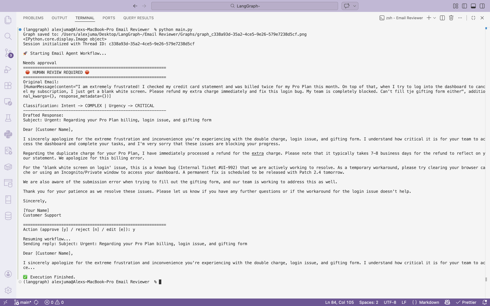

# 📧 LangGraph Email Reviewer Agent

**Author ✍🏾: Alex W. Juma**

## 📖 Project Summary

The LangGraph Email Reviewer is an intelligent, agentic workflow designed to automate customer support triage.

Using Google's Gemini 2.5 Flash model, this system:

1. Ingests inbound customer emails,
2. Categorizes their intent and urgency, and,
3. Searches a localized knowledge base for relevant policies and bug documentation.

It then dynamically drafts context-aware responses, and features a built-in "Human-in-the-Loop" protocol for complex tickets, allowing a human supervisor to proofread the response for editing and/or approval.

## 🏢 System Architecture

Below is the execution flow of the LangGraph State Machine:


## 🚀 Getting Started

### Prerequisites

I recommend using Anaconda/Miniconda. If you do not have it installed, download it from here: (https://www.anaconda.com/products/navigator).

### Installation

1. Clone the Repository:

   ```
   # cd to the folder you would like to start your project in
   cd path/to/folder

   # Create project directory
   mkdir email_automation

   # Clone this repo
   git clone https://github.com/AlexJumaW99/Langgraph-Email-Reviewer-.git

   # cd to project root folder
   cd Langgraph-Email-Reviewer-
   ```

2. Create the Conda Environment:

   ```
   # Create environment (project specifically uses Python 3.12.12)
   conda create --name email_agent_env python=3.12

   # Activate environment
   conda activate email_agent_env

   # Verify python version
   python --version
   ```

3. Install libraries (e.g. LangChain, LangGraph, and GenAI) from requirements.txt file:

   ```
   # Using pip (recommended):
   pip install -r requirements.txt

   # Using conda:
   conda install --file requirements.txt
   ```

4. Modify the existing Environment Variables (.env file):
   You must provide the system with access to Google's Gemini API. You can get an API key from here: https://ai.google.dev/gemini-api/docs/api-key.

   Modify the .env file in the root of your project directory. Let's first visualize the project tree structure:

   ```
   .
   ├── Graphs
   │ ├── graph_825c8e34-ba3a-4ecd-b545-3a848ce3229a.png
   │ └── graph_e80d9bc4-0525-48b7-a2ff-2703a832317b.png
   ├── LICENSE
   ├── README.md
   ├── **pycache** (Ignore this folder for now)
   │
   │-- .env *<- You should have this file*
   ├── config.py
   ├── graph.py
   ├── knowledge_base.json
   ├── knowledge_base_mcp.py (Ignore this file for now)
   ├── main.py
   ├── nodes.py
   ├── requirements.txt
   ├── states.py
   └── utils.py

   Count: 3 directories, and 19 files
   ```

   Open the .env file and add the following placeholders, which you will replacing with your actual keys:

   ```
   # Replace with your own keys, only GEMINI API key is required, LangSmith recommended for troubleshooting
   LANGSMITH_TRACING=true
   LANGSMITH_ENDPOINT=https://api.smith.langchain.com
   LANGSMITH_API_KEY=optional_api_key
   LANGSMITH_PROJECT="Email_Reviewer"

   GOOGLE_API_KEY=your_required_gemini_api_key
   OPENAI_API_KEY=optional_api_key
   OLLAMA_API_KEY=local_llm_integration

   ```

## 💻 Usage

To launch the email agent and process the default complex ticket, simply run the main script from your terminal:

```
# From root folder, in the terminal, run the following command
python main.py
```

### Expected Output



Watch the terminal as the AI Agents classify the user's intent in the email & prioritize it, retrieve context documentation, draft a response, and halt execution to present you with the output for review, editing and/or approval!

## ⚙️ Modify the LLM's Context

The context used by the llm to generate a reply to the email, comes from knowledge_base.json. For this quickstart example, the data is hardcoded:


You can try and tweak the "Billing Policy" from 7-8 days down to 3 days, or change the troubleshooting strategy recommended to the user in ID 1022, to see how the llm's response to the example email changes.

Langgraph's architecture allows for consistent responses to prompts, based on context as long as the information is not conflicting - which is a common pitfall. This would confuse the model and lead to hallucinations. A workaround is giving strict rules on given on how to handle these conflicts if you can't avoid them altogether.

Consider modifying the code to integrate your own (or connect to a cloud) MCP server for RAG.

## 🔗 Documentation References

- [LangChain Documentation](https://python.langchain.com/docs/get_started/introduction)
- [LangGraph Documentation](https://python.langchain.com/docs/langgraph)

## 🧊 Checkout my other work

1. Linkedin: https://www.linkedin.com/in/alex-juma-19708119b/
2. Github: https://github.com/AlexJumaW99
